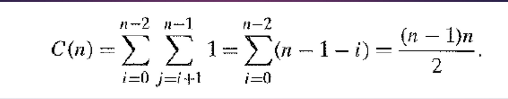

# Brute Force:
-> Slow for very high value of 'n' <br>
-> Straight forward approach to solving a problem <br>
-> Directly based on problem statement and definition involved <br>
-> One of the easiest method to apply <br>
-> Brute force search AKA **Exhaustive Search**. <br>
&nbsp;&nbsp;&nbsp;&nbsp;-> enumerates all possible candidates for solutions. <br>
-> Ex:
- Brute force method to find divisors for a natural number 'n' will be:
	- enumerate all numbers from 1 - n
	- check wether each of them divides n without a ramainder.
- 8 queens puzzle:
	- examine all enumerations (possibilities) of the 8 queens
	- (8x8)<sup>8</sup> possibilities, very inefficient
- Brute force search -> linear search <br>
-> Used when:
- Problem size is limited <br>
-> Brute force SORTING ALGORITHMS: 
O(n<sup>2</sup>)
- Selection Sort
- Bubble Sort
### Selection Sort:
#### Idea:
- Scan the array -> find its smallest element -> swap it with the first element
- Starting with second element -> scan the elements to the right of it -> find
the smallest among them -> swap it with the second element
#### Algorithm:
```c
ALGORITHM Selection Sort(A[0...n-1])
// Sorts a given array by selection sort
// Input: array of sortable elements A[0...n-1]
// Output: array of sorted elements in ascending order
for i <- 0 to n - 2 do
	min <- i
	for j <- i + 1 to n - 1 do
		if A[j] < A[min]
			min <- j
	swap A[i] and A[min]
```
#### Analysis:
- Main operation: Comparision
- Input size: n

(n-1) - (i+1) - 1 = (n - 1 - i) = n(n-2 - 0 + 1) - (n - 2 - 0 + 1) - ((n - 2)<sup>2</sup> / 2) = n<sup>2</sup> - n - n + 1 -     n<sup>2</sup>/2 + 2n + 1 = n<sup>2</sup>/2 + 2
#### Example:
1. 8,4,6,9,2,3,1 <br>
	1 4 6 9 2 3 8 : swap = 1 <br>
	1 2 6 9 4 3 8 : swap = 2 <br>
	1 2 3 9 4 6 8 : swap = 3 <br>
	1 2 3 4 9 6 8 : swap = 4 <br>
	1 2 3 4 6 9 8 : swap = 5 <br>
	 1 2 3 4 6 8 9 : swap = 6 <br>
	Total Swaps = 6 <br>
- Sorting algorithm is stable if it preserves the positions/order of the original (equal) elements
- Swaps = order(n)
2. 8,4,6,6,2,3,1 (repeating elements)