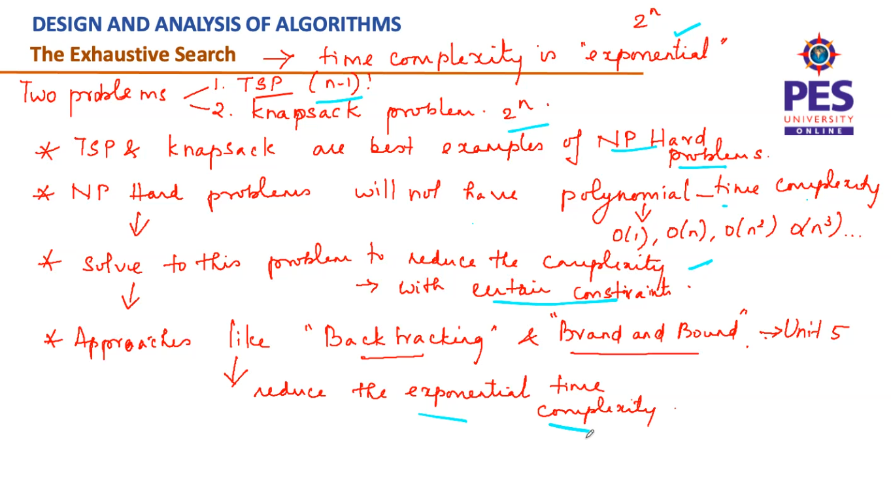

### Knapsack Problem:
#### Idea:
- n items -> weights : W1 - Wn  -> values : V1 - Vn 
- knapsack of capacity : W
- To find the most valuable subset of items that fit into the knapsack
- Total subsets = 2n - 1 (excluding {}) 
- Exclude the ones which exceed 'W'
- Select the one with the max value out of the remaining
  
![[4.png]]  
![[5.png]] 
![[6.png]] 
![[7.png]]  
