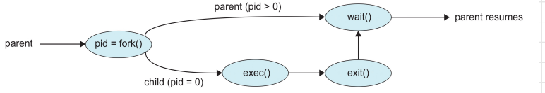

#### Process Creation:
- Parent processes create child processes which may create more processes -> creates a tree
- process identified by -> process id (pid)
- resource sharing options:
	- share all resources
	- children has subset of resources
	- share no resources
- execution options:
	- execute concurrently
	- parent waits till child terminates
- **fork():**
	- address space:
		- child duplicate of parent
		- child has program loaded into it
	- fork() - creates new child process
	- exec() - sys call used aft fork() to replace mem space with new program



```C
#include <stdio.h>
#include <unistd.h>
#include <sys/types.h>
#include <sys/wait.h>
int main() {
	pid_t process_code;
	process_code = fork();
	if(process_code < 0) { /* An error occurred */
		fprintf(stderr, "Error occurred while forking\n");
		return 1;
	}
	else if(process_code == 0) { /* child process */
		execlp("/bin/ls", "ls", NULL);
	}
	else { /* Parent process waits for child process to finish */
		wait(NULL);
		printf("Child process completed!\n");
	}
	return 0;
}```

#### Process termination:
- Process executes last statement and then asks the operating system to delete it using the **exit()** system call
	- Returns status data from child to parent (via wait())
	- process resources are deallocated by OS
- Parent may terminate the execution of children processes using the **abort()** if:
	- Child has exceeded allocated resources
	- Task assigned to child is no longer required
	- The parent is exiting and the operating systems does not allow a child to continue if its parent terminates
- If parent terminates all child processes and even the grand-children processes must be terminated -> **cascading termination** -> initiated by OS
- Parent process waits for child to terminate -> wait() -> gives exit status and pid of child process that terminated
- child process -> terminated -> parent -> hasn't called wait() yet -> **zombie process**
	- all processes enter zombie state for a small time
- child process -> terminated -> parent -> terminated before calling wait() -> **orphan process**
	- handled by assigning **init** as parent process of all orphans
	- init periodically calls wait() allowing orphaned process to be released