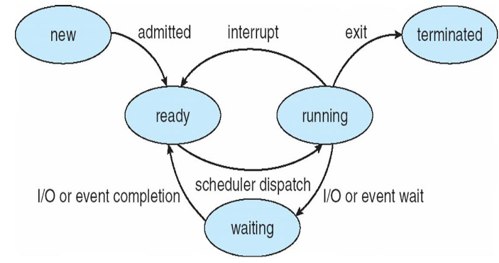

#### Concept:
- OS executes various programs
	- batch systems - jobs
	- time-shared systems - tasks/user programs
	- above terms used interchangably
- A process is defined as a program under execution
- program : passive entity; file stored on disk
- process : active; when executable file loaded onto memory
- parts of a process:
	- Text/Program Code: Source code of the program that generated the process
	- Program Counter, Process Registers: These identify the current activity of the process
	- Stack: A temporary data store for **function parameters**, **local variables** and **function return addresses**
	- Global Data: For all global and static variables
	- Heap: Space for all memory allocated by the process at runtime
- processes associated with same program are considered as 2 different execution sequences
- process may spawn new processes as it runs

#### Process States:
- New: Process is being created
- Running: Process instructions are being executed
- Waiting: Process is waiting for an I/O operation or memory access
- Ready: The process is waiting to be assigned to a processor
- Terminated: The process has finished execution

#### Process Control Block: (PCB)
- aka task control block
- holds all info needed to identify and manage a process
- **Process State**: One of the 5 states described above
- **Program Counter**: Address of the next instruction to execute.
- **CPU Registers**: include accumulators, index registers, stack pointers, and general-purpose registers, plus any condition-code information.
	- Along with the program counter, this state information must be saved when an interrupt occurs, to allow the process to be continued correctly afterward
- **Scheduling Info.**: Pointers to process queues, process priority
- **Memory Management Info.**: This information may include such items as the value of the base and limit registers and the page tables, or the segment tables, depending on the memory system used by the operating system
- **Accounting Info.**: CPU hours and real time hours used, time limits, account numbers, job
or process numbers
- **I/O Device Info.**: List of all I/O devices allocated to the process, list of all files accessed
by the process.

#### Threads:
- Light weighted processes
- allow processes to perform multiple tasks at the same time
- All the threads belonging to a particular process **share the same address space** but have **different program counters** of their own.
- On multi core machines, threads can run in parallel, improving process performance

#### Process Scheduling:
- Process scheduler selects among available processes
- maintains scheduling queues of processes (migrate among queues)
- **Scheduling Queues:**
	- **Job queue**: set of all processes in system
	- **Ready queue**: set of processes in memory, ready and waiting to execute
	- **Device queues**: set of processes waiting for I/O devices or disk
- **Process Schdulers:**
- 3 types:
	- Long-term:
		- selects process from **job pool** and loads it into the memory
		- used once evry few mins
		- controls the degree of multiprogramming
	- Short-term:
		- aka CPU scheduler
		- selects process from **ready processes** and allocates to CPU
		- more frequently used than long-term - in milli sec range
	- If all are I/O bound -> short term sched has nothing to do -> **I/O bound Process**
	- If all are CPU bound -> I/O devices will be unsused -> **CPU bound Process**
	- hence to have a good mix we use medium-term scheduler
	- Medium-term:
		- used to reduce degree of multiprogramming
		- swaps out waiting processes from memory to disk and reload into memory -> **swapping**

#### Context Switching:
- CPU switches from process to process
-  the system must save the state of the old process and load the saved state for the
new process via a context switch
- Context of a process represented in the PCB
- executing P0 -> interrupt/sys call -> save state into PCB0 -> idle P1 -> reload state from PCB1 -> executing P1-> interrupt/sys call -> save state into PCB1 -> idle P1 -> reload state from PCB0 -> executing P0
- when one executes the other is idle and vice versa
-  more complex the OS and the PCB -> longer the context switch