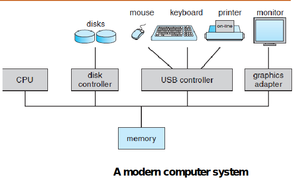
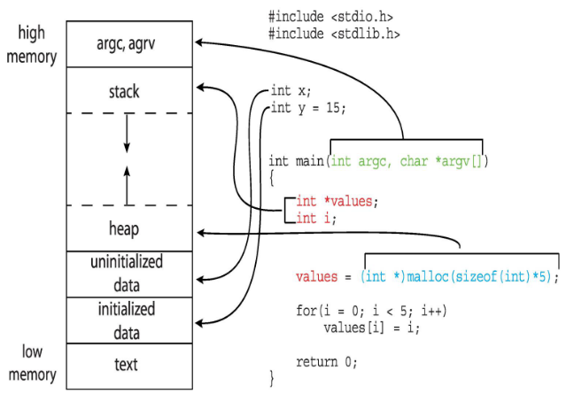
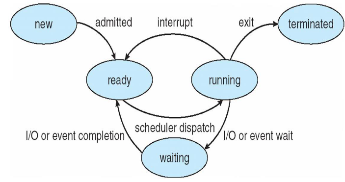
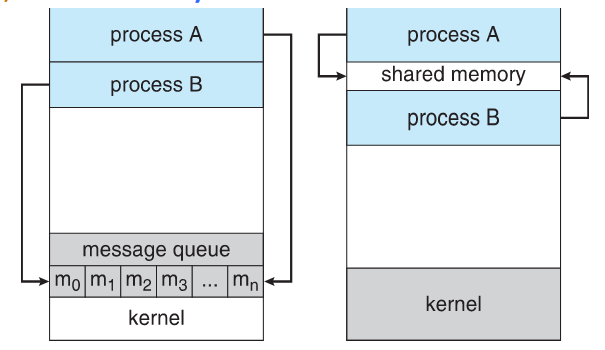

### What is an Operating System?
#### Definition:
- Intermediary between the user and hardware being used.
- It provides a user-friendly environment in which a user may easily
develop and execute programs.

##### Goal of an OS:
- Execute user programs and make solving user problems easier
- Make the computer system convenient to use
- Use the computer hardware in an efficient manner
- Manage resources such as: 
	- memory
	- processors
	- I/O devices

#### Components of a Computer System:
- Hardware:
	- CPU
	- Memory
	-  I/O devices
- OS: Controls and co-ordinates hardware usage among various applications
- Application Programs: ways in which system's resources are used to solve computing problems
- Users: People, machines or other computers

#### What an OS does:
##### System view:
- Resource allocator
	- manages all resources
	- decides between conflicting resource requests
- Control Program
	- controls execution of programs to prevent errors and improper use of the computer

##### User view:
- Convenient access od computational power
- Easy to use
- Offers good performance
- The end user does not care much about actual resource usage in the computer

### Computer System Organisation
- A computer consists of hardware resources which are to be managed by the OS
- CPU(s) and device controllers have access to shared memory via a common bus
- Each device controller is in charge of particular device type and has local memory
- Device controller sends interrupt to CPU when task is completed.
- CPU(s) and data controllers compete for **memory cycles** and can run concurrently
- **Memory controller** is provided to synchronise access to memory



#### Bootstrap:
- It is the first program to be executed when the system is booted
- stored in ROM
- aka **firmware**
- initialises all aspects of the system - CPU regs, IO devices, etc.
- Loads OS kernel onto the main memory
- First program created is called **init** waits for an event to occur (interrput)

#### Interrupts:
- An OS is interrupt driven
- An event occurrence is defined by a signal known as an **interrupt**.
- Interrupt is provided by the peripheral devices to the CPU
- Interrupt transfers control to -> Interrupt Service Routine (ISR) via -> the Interrupt Vector Table (IVT) -> contains the addresses of all the service routines
- **Interrupt Handling**
	- Storing the current PC and register values before interrupt was received by CPU
	- 2 methods: (same as MPCA)
		1. Polling: 
			- Read the state (busy/available) of each I/O device in a list and then service the one who makes a request.
			- Repeat continuously while CPU has power.
		2. Vectored Interrupts:
			- The device notifies the CPU that it needs attention. 
			- The CPU reads the address of the appropriate ISR from the IVT and pauses the current program execution to handle the ISR.

#### Storage:
- Main Memory: 
	- CPU can access directly
	- volatile
	- random access
	- DRAM in computers
	- EEPROMs in mobile phones
- Secondary Memory: 
	- non-volatile
	- large capacity
	- permanent storage of data and programs
	- Hard disks:
		- disk -> tracks -> sectors
		- disk controller is used to interact b/w device and computer
	- SSD:
		- faster than Hard disks 
- Cache:
	- caching: copying information into faster storage system
	- to access info faster
- Registers
- Device drivers:
	- for managing each IO device
	- uniform interface b/w kernel and controller

Memory hierarchy:
(in order of increasing size/decreasing cost/decreasing speed)
register -> cache -> main memory -> ssd -> hard disk -> optical disk -> magnetic tapes

#### I/O Structure:
1. After I/O starts control returns to user program only after completion of I/O:
	- CPU idles until next interrupt given (wait instruction)
	- No simultaneous yo processing can occur
2. After I/O starts control returns to user program without waiting for I/O completion:
	- system call : request to OS to allow user to wait for I/O completion
	- Device-status table: contains entry for each I/O device indicating its type, address, and state
	- OS indexes into I/O device table to determine device status and to modify table entry to include interrupt

#### DMA Structure:
- used for high speed I/O devices
- device controller transfers data directly from device to main memory without CPU intervention
- only one interrupt generated **per block** rather than per byte


### Computer System Architecutre:
#### Single processor:
- A single general-purpose CPU executes a general-purpose instruction set, including instructions from user processes.
- May contain **special purpose** processors like disk, keyboard, graphic controller
	- run a limited amt of instructions
- managed and monitored by OS

#### Multiprocessor:
- aka **parallel systems/tightly-coupled systems**
- Advantages:
	-  increased throughput
	- economy of scale
	- increased reliability
- graceful degradation:
	- faliure of hardware -> only proportional drop in performance
- fault tolerant: 
	- faliure of a component -> continued operation 
	- this kind of system needs faliure detection, diagnosis, and correction
- 2 types:
	1. Asymmetric multiprocessing:
		- each processor -> specific task
		- no shared memory
	2. Symmetric multiprocessing: 
		- each processor -> all tasks
		- shared memory
- **DUAL core:**
	- multi core, multi chip
	- systems containing all chips ; chassis containing multiple separate systems
- All multicore systems are multiprocessor systems, but all multiprocessor systems are not multicorem systems.
- **Blade servers:**
	- systems in which multiple processor boards, I/O boards, and networking boards are placed in the same chassis
	- board boots independently and runs its own OS
	- some are multiprocessors as well
	- multiple independent multiprocessor systems

#### Clustered Systems:
- Multiple systems working together (over a network)
- Storage shared using -> Storage Area Network (SAN)
- High availability service
- Survives faliures
- 2 types:
	- Asymmetric -> 1 machine in hot standby mode takes over in case of faliure
	- Symmetric -> multiple nodes running app monitoring each other
- some are for High Performance Computing (HPC)
- may have distributed lock manager (DLM) -> avoid shared data conflicts


#### Multiprogramming:
- aka **batch system**
- needed for efficiency
- one user cant keep CPU busy all the time
- paradigm that allows the CPU to always have atleast one job to do (in terms of either I/O device handling or user program handling)
- working:
	- OS -> maintains job pool of all processes on disk -> picks a job (job 1) -> begins execution
	- jobs in main mem are subset of this job pool
	- if job 1 waits (for an I/O operation) -> OS swiches to job 2 and executes instead of sitting idle
	- when job 2 waits again OS switches to new job and so on..
	- when job 1 finishes waiting -> CPU takes back the control
	- this way CPU is never idle
- these systems only handle hardware usage not user interaction with the hardware

#### Multitasking (Time sharing):
- extension of multiprogramming -> CPU switches between jobs at a very fast rate and more frequently
- allows multiple users to access a single computer
- choosing which job to do is the task of **job scheduling algorithms**
- to ensure reasonable response time **swapping** is done -> swap process in and out of main memory
- another method is using virtual memory
	- enables users to run programs that are larger than actual physical memory
	- abstracts main memory into a large, uniform array of storage, separating logical memory as viewed by the user from physical memory.
- these OSes provide:
	-  file system
	- disk managemetn
	- resource protection mechanism
	- job sync and communication to prevent deadlock


- Interrupt driven:
	- Hardware: by some device
	- Software:
		- software error - div by 0
		- request for os service
		- infinite loop, process modifying each other or the OS

#### Dual mode and Multi mode Operation of an OS:
1. Dual mode:
	- allows OS to protect itself and other system components
	- 2 modes:
		- **user mode**
		- **kernel mode**
	- mode bit:
		- used to distinguish when system is running user code or kernel code
		- privilaged instructtions only executable in kernel mode
		- system calls change mode to kernel and return resets it to user mode
2. Multi mode:
	- VM manager mode for VMs
	- The VMM (Virtual Machine Management) is at a privilege level above the user but below the kernel, which is needed to change the CPU state while creating virtual machines.
- Transition from User -> Kernel mode:
	- on an interrupt hardware switches from user -> kernel mode (mode bit = 0)
	- request is fulfilled -> switch back before passign control to user program
- **System Timer**:
	- used to prevent infinite loop/process hogging resources
	- OS sets the counter
	- used to terminate the program if it takes too long 
	- Variable timers are implemented using the system clock in combination with a down counter.

#### Kernel DS:
- Arrays
- LL
	- SLL
	- DLL
	- CLL
- Stack
- Trees
- Hash Functions and Maps
- Bitmap


#### Traditional:
- Stand-alone general purpose machines
- Portals: provide web access to internal systems
- Mobile computers interconnect via wireless networks
- eg: company servers

#### Mobile:
- Handheld smartphones, tablets, etc
- Extra feature – more OS features (GPS, gyroscope)
- Allows new types of apps like augmented reality
- Use IEEE 802.11 wireless, or cellular data networks for connectivity
- eg. Android, iOS

#### Distributed:
- Collection of separate, possibly heterogeneous, systems networked together
	- LAN
	- WAN
	- MAN
	- PAN
- Network Operating Systems:
	- Communication scheme allows systems to exchange messages
	- Illusion of a single system

#### Client-Server:
- servers respond to client requests
	- Compute-server system: provides an interface to client to request services (i.e., database)
	- File-server system: provides interface for clients to store and retrieve files

#### Peer-to-Peer:
- Another model of distributed system
- does not distinguish clients and servers
- all nodes are considered peers
- ex: VoIP, Napster, Gnutella

#### Virtualisation:
- Allows operating systems to run applications within other OSes
- host OS runs guest OS as application
- source CPU diff from target CPU --- emulation
- OS natively compiled for CPU running guest OSes also natively compiled --- virtualisation

#### Cloud Computing:
- Delivers **computing**, **storage**, even **apps** as a service across a network
- Logical extension of virtualization
- Types:
	- public
	- private
	- hybrid
- SaaS - Software (eg: word processor)
- PaaS - Platform (eg: database server -software stack)
- IaaS - Infrastructure (eg: storage available for backup)

#### Real time Embedded:
- most prevalent form of computers
- vary considerable, special purpose, limited purpose OS, real-time OS
- special computing environments as well
	- some have OS some perform tasks without OS also
- Has well-defined fixed time constraints
	- Processing must be done within constraint 
	- Correct operation only if constraints met


#### Functions helpful to the user:
- User Interface:
	- CLI
	- GUI
- Program Execution:
	- system must be able to load a program into memory and to run that program, end execution, either normally or abnormally (indicating error)
- I/O operations: A running program may require I/O, which may involve a file or an I/O device
- File-system manipulation: Programs need to read and write files and directories, create and delete them, search them, list file Information, permission management.
- Communications:
	- may be via shared memory or through message passing (packets moved by the OS)
- Error detection:
	- CPU/Memory errors, I/O device errors, user errors. Take appropriate action as per error type, and ensure correct and consistent computing.

#### Functions helpful to the system:
- Resource allocation:
	- when multiple processes are running resources must be allocated to each of them
- Accounting: keep track of which users use how much and what kinds of computer resources 
- Protection and security: to control use of that information, concurrent processes should not interfere with each other
	- **Protection** involves ensuring that all access to system resources is controlled
	- **Security** of the system from outsiders requires user authentication, extends to defending external I/O devices from invalid access attempts


#### Policy and Mechanism:
- User goals and System goals
	- User goals - should be convenient to use, easy to learn, reliable, safe, and fast
	- System goals - hould be easy to design, implement, and maintain, as well as flexible, reliable, error-free, and efficient
- policy : what to do
- mechanism : how to do
- separation of policy and mechanism imp -> gives flexibilty

#### Implementation:
- Assembly lang -> system programming languages like Algol, PL/1 -> Now C, C++
- usually a mix of languages:
	- lowest level - assembly
	- main body - C
	- system programs - C, C++, scripting langs -> Perl, Python, Shell script
- high level lang -> easier to port , but slower
- Emulation can allow an OS to run on non-native hardware

#### Concept:
- OS executes various programs
	- batch systems - jobs
	- time-shared systems - tasks/user programs
	- above terms used interchangably
- A process is defined as a program under execution
- program : passive entity; file stored on disk
- process : active; when executable file loaded onto memory
- parts of a process:
	- Text/Program Code: Source code of the program that generated the process
	- Program Counter, Process Registers: These identify the current activity of the process
	- Stack: A temporary data store for **function parameters**, **local variables** and **function return addresses**
	- Global Data: For all global and static variables
	- Heap: Space for all memory allocated by the process at runtime
- processes associated with same program are considered as 2 different execution sequences
- process may spawn new processes as it runs



#### Process States:
- New: Process is being created
- Running: Process instructions are being executed
- Waiting: Process is waiting for an I/O operation or memory access
- Ready: The process is waiting to be assigned to a processor
- Terminated: The process has finished execution



#### Process Control Block: (PCB)
- aka task control block
- holds all info needed to identify and manage a process
- **Process State**: One of the 5 states described above
- **Program Counter**: Address of the next instruction to execute.
- **CPU Registers**: include accumulators, index registers, stack pointers, and general-purpose registers, plus any condition-code information.
	- Along with the program counter, this state information must be saved when an interrupt occurs, to allow the process to be continued correctly afterward
- **Scheduling Info.**: Pointers to process queues, process priority
- **Memory Management Info.**: This information may include such items as the value of the base and limit registers and the page tables, or the segment tables, depending on the memory system used by the operating system
- **Accounting Info.**: CPU hours and real time hours used, time limits, account numbers, job
or process numbers
- **I/O Device Info.**: List of all I/O devices allocated to the process, list of all files accessed
by the process.

#### Threads:
- Light weighted processes
- allow processes to perform multiple tasks at the same time
- All the threads belonging to a particular process **share the same address space** but have **different program counters** of their own.
- On multi core machines, threads can run in parallel, improving process performance

#### Process Scheduling:
- Process scheduler selects among available processes
- maintains scheduling queues of processes (migrate among queues)
- **Scheduling Queues:**
	- **Job queue**: set of all processes in system
	- **Ready queue**: set of processes in memory, ready and waiting to execute
	- **Device queues**: set of processes waiting for I/O devices or disk
- **Process Schdulers:**
- 3 types:
	- Long-term:
		- selects process from **job pool** and loads it into the memory
		- used once evry few mins
		- controls the degree of multiprogramming
	- Short-term:
		- aka CPU scheduler
		- selects process from **ready processes** and allocates to CPU
		- more frequently used than long-term - in milli sec range
	- If all are I/O bound -> short term sched has nothing to do -> **I/O bound Process**
	- If all are CPU bound -> I/O devices will be unsused -> **CPU bound Process**
	- hence to have a good mix we use medium-term scheduler
	- Medium-term:
		- used to reduce degree of multiprogramming
		- swaps out waiting processes from memory to disk and reload into memory -> **swapping**

#### Context Switching:
- CPU switches from process to process
-  the system must save the state of the old process and load the saved state for the
new process via a context switch
- Context of a process represented in the PCB
- executing P<sub>0</sub> -> interrupt/sys call -> save state into PCB<sub>0</sub> -> idle P<sub>1</sub> -> reload state from PCB<sub>1</sub> -> executing P<sub>1</sub>-> interrupt/sys call -> save state into PCB<sub>1</sub> -> idle P<sub>1</sub> -> reload state from PCB<sub>0</sub> -> executing P<sub>0</sub>
- when one executes the other is idle and vice versa
-  more complex the OS and the PCB -> longer the context switch


#### Process Creation:
- Parent processes create child processes which may create more processes -> creates a tree
- process identified by -> process id (pid)
- resource sharing options:
	- share all resources
	- children has subset of resources
	- share no resources
- execution options:
	- execute concurrently
	- parent waits till child terminates
- **fork():**
	- address space:
		- child duplicate of parent
		- child has program loaded into it
	- fork() - creates new child process
	- exec() - sys call used aft fork() to replace mem space with new program


```C
#include <stdio.h>
#include <unistd.h>
#include <sys/types.h>
#include <sys/wait.h>
int main() {
	pid_t process_code;
	process_code = fork();
	if(process_code < 0) { /* An error occurred */
		fprintf(stderr, "Error occurred while forking\n");
		return 1;
	}
	else if(process_code == 0) { /* child process */
		execlp("/bin/ls", "ls", NULL);
	}
	else { /* Parent process waits for child process to finish */
		wait(NULL);
		printf("Child process completed!\n");
	}
	return 0;
}
```

#### Process termination:
- Process executes last statement and then asks the operating system to delete it using the **exit()** system call
	- Returns status data from child to parent (via wait())
	- process resources are deallocated by OS
- Parent may terminate the execution of children processes using the **abort()** if:
	- Child has exceeded allocated resources
	- Task assigned to child is no longer required
	- The parent is exiting and the operating systems does not allow a child to continue if its parent terminates
- If parent terminates all child processes and even the grand-children processes must be terminated -> **cascading termination** -> initiated by OS
- Parent process waits for child to terminate -> wait() -> gives exit status and pid of child process that terminated
- child process -> terminated -> parent -> hasn't called wait() yet -> **zombie process**
	- all processes enter zombie state for a small time
- child process -> terminated -> parent -> terminated before calling wait() -> **orphan process**
	- handled by assigning **init** as parent process of all orphans
	- init periodically calls wait() allowing orphaned process to be released


- processes commonly alternate between periods of heavy CPU activity (a CPU burst) and periods of high I/O activity (an I/O burst)
- frequency of I/O bursts and CPU bursts is imp in choosing scheduling algorithm

#### Types of Scheduling:
- 2 types:
	1. **Preemptive**:
		- running -> ready : interrupt
		- waiting -> ready : I/O to CPU
		- can lead to race conditions -> **mutex locks** prevent this while accessing shared data from kernel DS
		- can affect kernel design
	2. **Non preemptive**:
		- running -> waiting : CPU to I/O or memory access or wait()
		- process terminates
		- once a process is allocated the CPU, it takes control of the CPU until it has to wait or it terminates. 
- **dispatcher** gives control fo CPU tp process selected by the short-term scheduler
	- invokes a context-switch -> switch to user mode -> jump to location in user program and start execution
	- time taken for the dispatcher to stop one process and start another is called the **dispatch latency**
	- invoked by every process

#### Scheduling Criteria:
- **CPU Utilization:** The fraction of time the CPU is kept busy. 40-90 % max
- **Throughput:** Number of processes completed per unit time
- **Turnaround time:** Interval between process submission and process completion. 
	- amount of time to execute a particular process
- **Waiting time:**  amount of time a process has been waiting in the ready queue
	- Sum of all time periods spent by process in the wait queue
- **Response Time:** Time between process submission and first response. 
- **optimisation criteria:**
	- MAX : CPU utilization, Throughput
	- MIN: turnaround time(TAT), Waiting time, Response Time

#### Scheduling Algorithms:
1. **First Come First Serve: (FCFS)**
	- The effect of a long process in front of many short processes, making the short processes wait for CPU time, is called the **convoy effect**
	- Non preemptive
2. **Shortest Job First: (SJF)**
	- shortest burst time first
	- τ<sub>n</sub>+1 = αt<sub>n</sub>+ (1 − α)τ<sub>n</sub>
		- τ<sub>i</sub> : predicted burst time
		- t<sub>i</sub> : actual burst time
		- α : constant value that's < 1 -> 0.5 generally
3. **Shortest Remaining Time First: (SRTF) / Preemptive SJF**
	- the process with the shortest CPU burst time is chosen, and the current process is pre-empted in its place.
4. **Priority Scheduling:**
	- Low priority processes may be blocked from CPU access by a steady stream of high priority processes arriving constantly. This problem is called **starvation**.
	- resolved by a process called **aging**, wherein the priority of a waiting process is increased after fixed intervals of time.
5. **Round Robin Scheduling: (RR)**
	- The fundamental unit of time in an RRS algorithm is called the **time slice** or **time quantum** (denoted as *q*)
	- very small q -> large overheads due to frequent context switching
	- large value of q -> RRS algorithm becomes a FCFS system instead
6. **Multilevel Queue Scheduling:**
	- process classified into groups -> foreground (interactive) and background (batch processes)
	- each grp has different scheduling requirements
	- ready is partitioned into smaller queues with their own algo and associated properties
	- process is assigned to queue based on some property like memory size, process priority, or process type
	- priority is also there within queues
	- time slice can also be put on queues
7. **Multilevel Feedback Queue Scheduling:**
	- This allows processes to move between all the various process queues, with the intent of separating processes according to their CPU burst times.
	- too much CPU time -> process moved to lower priority queue
	- aging is implemented to prevent starvation by moving process to higher priority queue
	- categorised by:
		- no. of queues and their scheduling algos
		- method to promote and demote process from one queue to another
		- method to determine queue for the new incoming processes


- processes commonly alternate between periods of heavy CPU activity (a CPU burst) and periods of high I/O activity (an I/O burst)
- frequency of I/O bursts and CPU bursts is imp in choosing scheduling algorithm

#### Types of Scheduling:
- 2 types:
	1. **Preemptive**:
		- running -> ready : interrupt
		- waiting -> ready : I/O to CPU
		- can lead to race conditions -> **mutex locks** prevent this while accessing shared data from kernel DS
		- can affect kernel design
	2. **Non preemptive**:
		- running -> waiting : CPU to I/O or memory access or wait()
		- process terminates
		- once a process is allocated the CPU, it takes control of the CPU until it has to wait or it terminates. 
- **dispatcher** gives control fo CPU tp process selected by the short-term scheduler
	- invokes a context-switch -> switch to user mode -> jump to location in user program and start execution
	- time taken for the dispatcher to stop one process and start another is called the **dispatch latency**
	- invoked by every process

#### Scheduling Criteria:
- **CPU Utilization:** The fraction of time the CPU is kept busy. 40-90 % max
- **Throughput:** Number of processes completed per unit time
- **Turnaround time:** Interval between process submission and process completion. 
	- amount of time to execute a particular process
- **Waiting time:**  amount of time a process has been waiting in the ready queue
	- Sum of all time periods spent by process in the wait queue
- **Response Time:** Time between process submission and first response. 
- **optimisation criteria:**
	- MAX : CPU utilization, Throughput
	- MIN: turnaround time(TAT), Waiting time, Response Time

#### Scheduling Algorithms:
1. **First Come First Serve: (FCFS)**
	- The effect of a long process in front of many short processes, making the short processes wait for CPU time, is called the **convoy effect**
	- Non preemptive
2. **Shortest Job First: (SJF)**
	- shortest burst time first
	- τ<sub>n</sub>+1 = αt<sub>n</sub>+ (1 − α)τ<sub>n</sub>
		- τ<sub>i</sub> : predicted burst time
		- t<sub>i</sub> : actual burst time
		- α : constant value that's < 1 -> 0.5 generally
3. **Shortest Remaining Time First: (SRTF) / Preemptive SJF**
	- the process with the shortest CPU burst time is chosen, and the current process is pre-empted in its place.
4. **Priority Scheduling:**
	- Low priority processes may be blocked from CPU access by a steady stream of high priority processes arriving constantly. This problem is called **starvation**.
	- resolved by a process called **aging**, wherein the priority of a waiting process is increased after fixed intervals of time.
5. **Round Robin Scheduling: (RR)**
	- The fundamental unit of time in an RRS algorithm is called the **time slice** or **time quantum** (denoted as *q*)
	- very small q -> large overheads due to frequent context switching
	- large value of q -> RRS algorithm becomes a FCFS system instead
6. **Multilevel Queue Scheduling:**
	- process classified into groups -> foreground (interactive) and background (batch processes)
	- each grp has different scheduling requirements
	- ready is partitioned into smaller queues with their own algo and associated properties
	- process is assigned to queue based on some property like memory size, process priority, or process type
	- priority is also there within queues
	- time slice can also be put on queues
7. **Multilevel Feedback Queue Scheduling:**
	- This allows processes to move between all the various process queues, with the intent of separating processes according to their CPU burst times.
	- too much CPU time -> process moved to lower priority queue
	- aging is implemented to prevent starvation by moving process to higher priority queue
	- categorised by:
		- no. of queues and their scheduling algos
		- method to promote and demote process from one queue to another
		- method to determine queue for the new incoming processes


- Soft:
	- They guarantee only that the process will be given preference over noncritical processes.
	- no guarantee as to **when** a critical real-time process will be scheduled
- Hard:
	- A task must be serviced by its deadline
	- service after the deadline has expired is the same as no service at all
- 2 types of delays to be minimised:
	- Interrupt latency: interval b/w interrupt arrival at CPU and start of it's ISR
		- finish current instr
		- save process state
		- switch context to ISR
	- Dispatch latency: time needed to stop one process anf schedule next one in ready queue
		- minimised using preemptive scheduling

#### Priority Scheduling:
- preemptive
- soft real time
- PCU required at constant intervals
- 0 <= processing <= deadline <= period
- rate of periodic task = 1/p (p->period)

#### Rate monotonic Scheduling:
- static priority scheduling
- priority assigned basesd on 1/p
- short p = high priority
- long p = low priority

#### Earliest Deadline First Scheduling (EDF):
- priorities assigned based on deadline
	- early deadline -> higher priority
	- later deadline -> lower priority
- process must annouce deadline before it becomes runnable

#### Proportional Share Scheduling:
- T shares allocated among all processes
- each process : N/T of processor time (N shares)

#### POSIX real-time Scheduling:
- provides api for managing real-time threads
- SCHED_FIFO : FCFS, no time slicing
- SCHED_RR : FCFS with time slicing for equal priority threads
- 2 functions:
```C
pthread_attr_getsched_policy(pthread_attr_t *attr, int *policy)
pthread_attr_setsched_policy(pthread_attr_t *attr, int *policy)
```


#### Pre v2.5:
- Before Linux 2.5, a variant of the UNIX scheduler was used.
- not built with SMP (symmetric multiprocessing) systems in mind

#### v2.5-v2.6.22:
- O(1) scheduler, named because of its constant time complexity
- maintains arrays of active and expired processes
- Each process is given a fixed time quantum, after which it is preempted and moved to the expired array
- active array empty -> expired becomes new active array
- did not suit the interactive processes that run on desktop systems

#### v2.6.23+:
- **Completely Fair Scheduler (CFS)** is the default Linux scheduling algorithm for versions
2.6.23 and beyond of Linux.
- based on **priority classes**, with each class assigned a certain priority
- standard kernel implements two classes :
	- based on the CFS
	- other one for real-time processes
- proportion of CPU time alloted to each process is based on the calculated **nice value** of that process (between **-20 to +19**) 
	- bigger nice value -> lower priority
- CFS doesn’t use discrete values of time slices
- The CFS uses the vruntime (virtual runtime) variable -> store how much time process is running for
- Real-time processes are assigned priorities between 0 and 99, while normal tasks are assigned priorities from 100 to 139.
- Normal tasks are assigned a priority based on their nice values, where a value of –20 maps to priority 100 and a nice value of +19 maps to 139.


- Priority based preemptive scheduling algorithm.
- The **dispatcher** is the portion of the Windows kernel that schedules processes.
- 32 priority classes -> divided into 2:
	- **Variable classes**: priority 1-15
	- **real-time classes**: priority 16-31
	- thread 0: memory management thread
- no ready threads -> dispatcher sneds **idle thread**
- The 6 main subclasses according to the Windows API are:
	- IDLE_PRIORITY_CLASS
	- BELOW_NORMAL_PRIORITY_CLASS
	- NORMAL_PRIORITY_CLASS
	- ABOVE_NORMAL_PRIORITY_ CLASS
	- HIGH_PRIORITY_CLASS
	- REAL-TIME_PRIORITY_CLASS : **no variable priority**
- User-mode scheduling introduced in Windows 7 allows user applications to create and manage threads independently of the kernel.
- Microsoft’s ConcRT runtime library for C++ allows user-mode scheduling, user apps to create and manage threads, as well as methods to divide applications into parallelizable tasks.


#### Processes:
- Independent: don't affect each other
- Co-operating: affect each other
	- info sharing
	- computation speed up - divide tasks
	- modularity
	- convinience
	- need IPC

#### 2 communication models of IPC:
- message passing
- shared memory



#### Producer-Consumer Problem:
- unbounded-buffer : Consumer may have to wait for new items, but the producer can always produce new items
- bounded-buffer : **Consumer** must wait if the buffer is **empty**; **producer** must wait if the buffer is **full**.
- implemented as **circular queue**
```C
#Producer
item next_produced;
while (true) {
	/* produce an item in next_produced */
	while (((in + 1) % BUFFER_SIZE) == out); /* do nothing */
	buffer[in] = next_produced;
	in = (in + 1) % BUFFER_SIZE;
}
```
```C
#Consumer
item next_consumed;
while (true) {
	while (in == out); /* do nothing */
	next_consumed = buffer[out];
	out = (out + 1) % BUFFER_SIZE;
	/* consume the item in next_consumed */
}
```

#### Shared Memory:
- two or more processes have access to same memory
- fastest form of IPC
- OS normally prevents processes from writing into each other’s dedicated memory -> for shared memory IPC this restriction is temporarily removed -> if both processes agree
- processes control format of data as well as coherency issue
- major issue -> mechanism to for synchronising actions -> semaphores used

#### Message Passing:
- Allows processes to communicate without sharing a common address space -> distributed systems -> process connected over a network
- Every Message Passing interface must provide a  **send(message)** and a **receive(message)** function.
- message size can be constant or variable

#### Communication:
- **direct:**
	- processes refer to each other explicitly when sending messages.
	- must know each other's identity
	- link is established -> each link associated with exactly 2 processes
	- may be symmetric or asymmetric
	- not desirable
- **indirect:**
	- messages are sent to and received from *mailboxes* or *ports*
	- only if processes share a mailbox, they can communicate
	- each pair may have several links and each link can connect several process
	- link : uni or bidirectional

#### Synchronisation:
- **blocking send:** sending process -> blocked till message being sent is received and read by receiving process/mailbox
- **non-blocking send:** Sending process can send a message and resume operation.
- **blocking recieve:** The receiver process blocks itself until a message arrives.
- **non-blocking recieve:** The receiver retrieves either a valid message or a NULL message.
- **both** send and recieve are **blocking** -> **rendezvous** b/w 2 processes -> solution to producer-consumer problem made trivial
```C
#producer:
message next_produced;
while (true) {
	/* produce an item in next_produced */
	send(next_produced);
}
```
```C
#consumer:
message next_consumed;
while (true) {
	receive(next_consumed);
	/* consume the item in next_consumed */
}
```
#### Buffering:
- queues of messages attached to link (temporary queue)
- implementation:
	- zero capacity: no messages are queued on a link -> sender must wait for rendezvous
	- bounded capacity: finite length of n messages -> sender must wait if full
	- inbounded capacity: infinite length -> sender never waits
- zero-capacity case is sometimes referred to as a message system with no buffering

#### Pipes:
- simplest form of IPC
- half duplex IPC
- 2 types:
	- Ordinary (Unnamed) Pipes:
		- cannot be accessed from outside the process that created it.
		- parent creates pipe to communicate with child
		- producer-consumer style (write-read)
		- half-duplex (unidirectional)
	- Named Pipes: can be accessed without a parent-child relationship
		- More powerful than ordinary pipes
		- bidirectional
		- several processes in same pipe
		- 2 pipes for 2 way